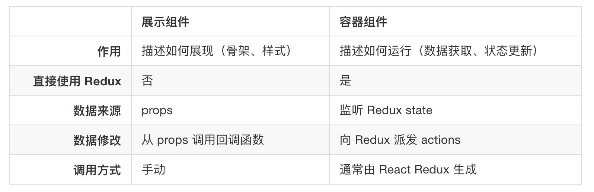

# react-redux

**需要注意 Redux 和 React 之间没有关系。Redux 支持 React、Angular、Ember、jQuery 甚至纯 JavaScript。**

## 容器组件和展示组件

容器组件和展示组件相分离的开发思想，建议阅读 [Presentational and Container Components](https://medium.com/@dan_abramov/smart-and-dumb-components-7ca2f9a7c7d0)。

## Todo List

### demo-01

1. react
2. redux
3. react-redux

### demo-02

1. react
2. redux
3. react-redux
4. reselect

## TODO

### demo-03

1. react
2. redux
3. react-redux
4. reselect
5. redux-actions

### demo-04

1. react
2. redux
3. react-redux
4. reselect
5. redux-actions
6. redux-saga

## 参考

1. [react 使用 redux](http://www.redux.org.cn/docs/basics/UsageWithReact.html)
2. [Presentational and Container Components](https://medium.com/@dan_abramov/smart-and-dumb-components-7ca2f9a7c7d0)